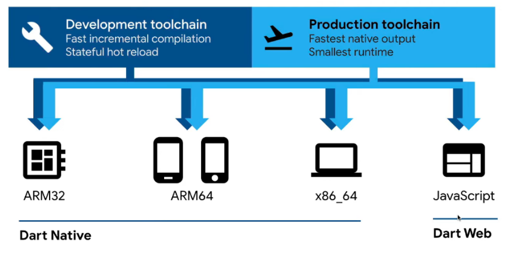

# dart-basic
Flutter를 본격적으로 공부하기 전, flutter 언어인 dart 공부 내용을 기록하기 위한 repository입니다.  
  

# Dart 개요 (Dart Overview)

**Dart**는 모든 플랫폼에서 빠르게 실행되는 앱을 개발하기 위해 설계된 **클라이언트 최적화(Client-optimized) 언어**. 
멀티 플랫폼 개발을 위한 높은 생산성과 앱 프레임워크를 위한 유연한 실행 런타임을 제공하는 것을 목표로 하며, **Flutter** 프레임워크의 기반이 되는 언어이기도 합니다.

## 1. 언어 특징 (Dart: The Language)
Dart는 개발 시의 편의성과 실행 시의 안전성을 모두 갖추고 있음.

* **타입 안전성 (Type Safe):** 정적 타입 검사를 통해 변수의 값과 타입이 항상 일치하도록 보장함.
* **Sound Null Safety (완전한 널 안전성):** 기본적으로 변수가 `null` 값을 가질 수 없도록 설정하여, 런타임에 발생할 수 있는 널 참조(Null Reference) 오류를 방지함. (개발자가 명시적으로 허용한 경우에만 `null` 가능)
* **유연한 타입 시스템:** 타입 추론(Type Inference)을 지원하여 타입을 생략할 수 있으며, 실험적인 코드나 동적인 처리가 필요할 때는 `dynamic` 타입을 사용할 수도 있다.

## 2. 라이브러리 (Dart: The Libraries)
Dart는 일상적인 프로그래밍 작업에 필요한 풍부한 **코어 라이브러리**를 내장하고 있음.

* **dart:core:** 기본 타입, 컬렉션 등 모든 Dart 프로그램의 핵심 기능.
* **dart:async:** `Future`, `Stream`과 같은 클래스를 통한 비동기 프로그래밍 지원.
* **dart:math:** 수학 상수, 함수 및 난수 생성.
* **dart:convert:** JSON, UTF-8 등 데이터 표현 변환을 위한 인코더/디코더.
* **dart:io:** 파일, 소켓, HTTP 등 비(非) 웹 애플리케이션을 위한 I/O 지원.
* **dart:isolate:** 메모리를 공유하지 않고 메시지로 소통하는 독립적인 워커(스레드와 유사)를 사용한 병행 프로그래밍.
* **dart:ffi:** C 스타일 인터페이스를 가진 다른 코드와의 상호 운용성 제공.
* **dart:js_interop & package:web:** 브라우저 및 DOM과 상호 작용하는 웹 앱 지원.

## 3. 플랫폼 (Dart: The Platforms)
Dart의 컴파일러 기술은 코드를 다양한 환경에서 최적화하여 실행할 수 있게 해준다.

### Native Platform (모바일 및 데스크톱)
모바일(iOS, Android)과 데스크톱(Windows, macOS, Linux) 기기를 타겟팅할 때 사용됨.
* **개발 중 (JIT):** Dart VM의 **JIT(Just-In-Time)** 컴파일러를 사용하여 코드 변경 사항을 즉시 반영하는 **Hot Reload** 기능을 제공, 빠른 개발 사이클을 가능하게 함.
* **배포 시 (AOT):** **AOT(Ahead-Of-Time)** 컴파일러를 사용하여 ARM 또는 x64 기계어로 컴파일한다. 이를 통해 앱이 즉시 시작되고 일관된 성능을 낼 수 있다.

### Web Platform (웹)
웹 브라우저에서 실행되는 앱을 타겟팅할 때 사용됨.
* **JavaScript 컴파일:** Dart 코드를 JavaScript로 변환하여 Chrome(V8 엔진) 등 브라우저에서 실행.
* **WebAssembly (WasmGC):** 최신 기술인 WasmGC로 컴파일하여 웹에서 초고속으로 실행 가능한 배포 코드를 생성.

## 4. Dart 런타임 (The Dart Runtime)
플랫폼이나 컴파일 방식에 상관없이, Dart 코드가 실행되려면 런타임 환경이 필요. 런타임은 다음과 같은 중요한 역할을 수행.

* **메모리 관리:** 가비지 컬렉터(GC)를 사용하여 사용되지 않는 메모리를 자동으로 회수.
* **타입 시스템 강제:** 대부분 컴파일 타임에 검사하지만, `is` 검사나 캐스트 연산자(`as`)와 같은 일부 동적 타입 검사를 런타임에 수행.
* **아이솔레이트(Isolate) 관리:** 앱의 메인 스레드 역할을 하는 메인 아이솔레이트와 추가 생성된 아이솔레이트들을 제어.

 

## 참고링크  
https://nomadcoders.co/